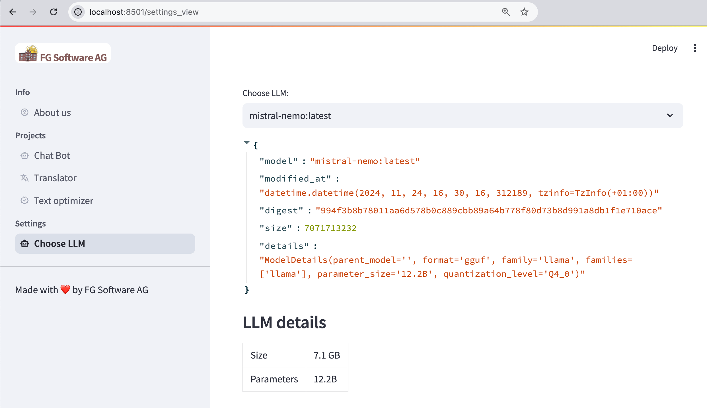

# FG AI App

FG AI App is a simple app written in Python leveraging Ollama LLMs and Streamlit UI.
The intention of this app is to teach working with AI powered by locally installed LLMs (Large Language Models)
and quickly build a web based UI using the Streamlit library.

## Screenshot

## Installation

### Prerequisites

- Python 3.12 and later
- Required libraries listed in `requirements.txt`

```bash
pip install -r requirements.txt
```

## How to run the app

```bash
streamlit run app.py
python -m streamlit run app.py    # Run configuration to start Streamlit from an IDE such as PyCharm
```

## Example




## License

This project is licensed under the MIT License. See the [LICENSE](LICENSE) file for more details.

## Credits

See the credits screen when running the game. 😎
